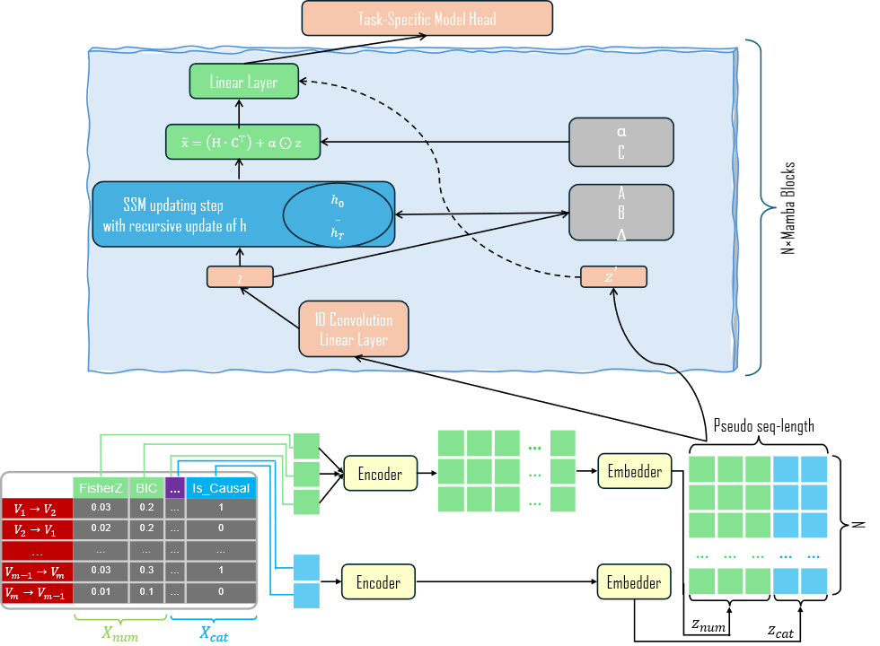
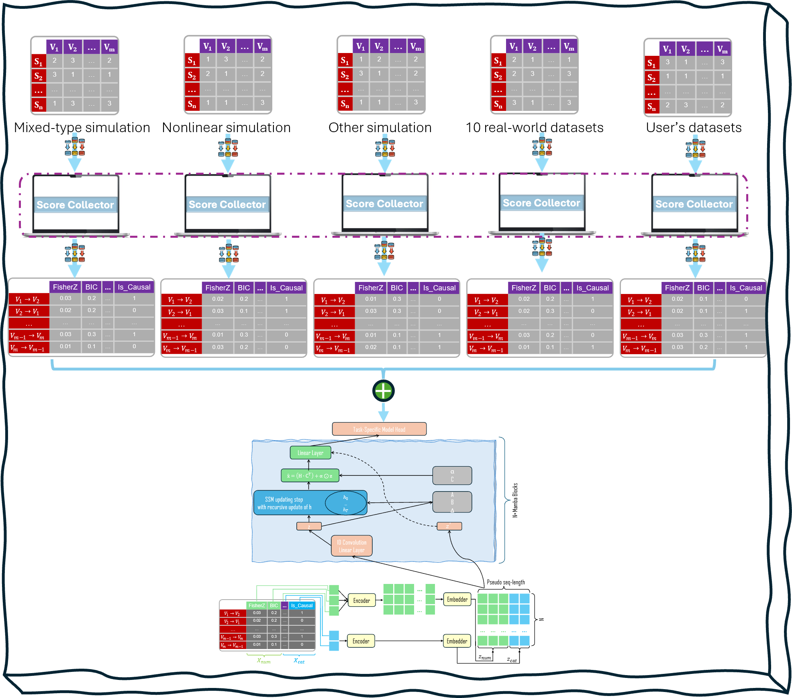
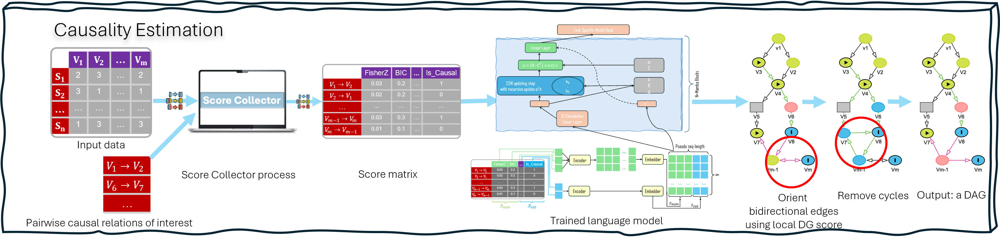

<!-- Improved compatibility of back to top link: See: https://github.com/othneildrew/Best-README-Template/pull/73 -->
<a id="readme-top"></a>
<!--
*** Thanks for checking out the Best-README-Template. If you have a suggestion
*** that would make this better, please fork the repo and create a pull request
*** or simply open an issue with the tag "enhancement".
*** Don't forget to give the project a star!
*** Thanks again! Now go create something AMAZING! :D
-->


<!-- PROJECT SHIELDS -->
<!--
*** I'm using markdown "reference style" links for readability.
*** Reference links are enclosed in brackets [ ] instead of parentheses ( ).
*** See the bottom of this document for the declaration of the reference variables
*** for contributors-url, forks-url, etc. This is an optional, concise syntax you may use.
*** https://www.markdownguide.org/basic-syntax/#reference-style-links
-->
[![Contributors][contributors-shield]][contributors-url]
[![Forks][forks-shield]][forks-url]
[![Stargazers][stars-shield]][stars-url]
[![Issues][issues-shield]][issues-url]
[![Unlicense License][license-shield]][license-url]
[![LinkedIn][linkedin-shield]][linkedin-url]


<!-- PROJECT LOGO -->
<br />
<div align="center">
  <a href="https://github.com/othneildrew/Best-README-Template">
    
  </a>

  <h3 align="center">CALM: A Causal Analysis Language Model for Tabular Data in Complex Systems with Local Scores, Conditional Independence Tests, and Relation Attributes</h3>

  <p align="center">
    An awesome causal relation estimation framework!
    <br />
    <a href="https://github.com/othneildrew/Best-README-Template"><strong>Explore the docs »</strong></a>
    <br />
    <br />
    <a href="https://github.com/othneildrew/Best-README-Template">View Demo</a>
    &middot;
    <a href="https://github.com/othneildrew/Best-README-Template/issues/new?labels=bug&template=bug-report---.md">Report Bug</a>
    &middot;
    <a href="https://doi.org/10.48550/arXiv.2510.09846">Link to the Project's Preprint</a>
  </p>
</div>


<!-- TABLE OF CONTENTS -->
<details>
  <summary>Table of Contents</summary>
  <ol>
    <li>
      <a href="#about-the-project">About The Project</a>
      <ul>
        <li><a href="#built-with">Built With</a></li>
      </ul>
    </li>
    <li>
      <a href="#getting-started">Getting Started</a>
      <ul>
        <li><a href="#prerequisites">Prerequisites</a></li>
        <li><a href="#installation">Installation</a></li>
      </ul>
    </li>
    <li><a href="#usage">Usage</a></li>
    <li><a href="#roadmap">Roadmap</a></li>
    <li><a href="#contributing">Contributing</a></li>
    <li><a href="#license">License</a></li>
    <li><a href="#contact">Contact</a></li>
    <li><a href="#acknowledgments">Acknowledgments</a></li>
  </ol>
</details>


<!-- ABOUT THE PROJECT -->
## About The Project
<br>
<div align="center">
  
</div>

Causal discovery from observational data is fundamental to scientific fields like biology, where controlled experiments are often impractical. However, existing methods, including constraint-based (e.g., PC, causalMGM) and score-based approaches (e.g., NOTEARS), face significant limitations. These include an inability to resolve causal direction, restrictions to linear associations, sensitivity to violations of the faithfulness assumption, and inefficiency in searching vast hypothesis spaces. While large language models (LLMs) offer powerful reasoning capabilities, their application is hindered by a fundamental discrepancy: they are designed for text, while most causal data is tabular. To address these challenges, we introduce CALM, a novel causal analysis language model specifically designed for tabular data in complex systems. CALM leverages a Mamba-based architecture to classify causal patterns from pairwise variable relationships. It integrates a comprehensive suite of evidence, including local causal scores, conditional independence tests, and relational attributes, to capture a wide spectrum of linear, nonlinear, and conditional causal mechanisms. Trained on a diverse corpus of synthetic data (from linear, mixed, and nonlinear models) and 10 real-world biological datasets with rigorously validated causal relationships, our model ensures robustness and generalizability. Empirical evaluation demonstrates that CALM significantly outperforms existing methods in both simulation studies, achieving over 91% accuracy, and in a real-world application identifying causal factors in Hepatitis C virus progression. This work represents a significant step towards accurate and generalizable causal discovery by successfully adapting the pattern recognition capabilities of language models to the intricacies of tabular data.


<p align="right">(<a href="#readme-top">back to top</a>)</p>


### Built With

* [![Java][Java.com]][Java-url]
* [![Python][Python.org]][Python-url]
* [![CUDA][https://developer.nvidia.com/cuda-toolkit]][CUDA-url]
* [![Tensorflow][tensorflow.org]][Tensorflow-url]
* [![Keras][keras.io]][Keras-url]
* [![Scikit-learn][scikit-learn.org]][scikit-learn-url]

<p align="right">(<a href="#readme-top">back to top</a>)</p>


<!-- GETTING STARTED -->
## Getting Started

This framework is implemented in Python, so it requires a Python environment. Additionally, a Java environment is needed for generating simulation data since we utilize the causality package Tetrad, which is written in Java. Many local scores are retrieved from the causal package Causal-learn. The deep learning models used in this framework are developed using TensorFlow and Keras. It is also recommended to have a CUDA environment for optimal performance.

### Prerequisites

Here is a list of the libraries and packages required for this framework.
* JDK
  ```sh
  #For instance, the following command line is used for installing the default Java Development Kit (JDK) available in the system's repositories.
  sudo apt install default-jdk
  ```
* [jpype1](https://pypi.org/project/jpype1/)
  ```sh
  #JPype is a Python package used for providing full access to Java APIs from within Python.
  pip install jpype1
  ```
* [pygraphviz](https://pygraphviz.github.io/)
  ```sh
  #PyGraphviz is a Python package used for the Graphviz graph layout and visualization.
  sudo apt-get install graphviz graphviz-dev
  pip install pygraphviz
  #Or use Conda
  conda install pygraphviz
  ```
* [NPEET](https://github.com/gregversteeg/NPEET)
  ```sh
  #The NPEET package contains Python code implementing several entropy estimation functions for both discrete and continuous variables.
  git clone https://github.com/gregversteeg/NPEET.git
  cd NPEET
  pip install .
  ```
* nvidia & cuda-nvcc
  ```sh
  #Compiler for CUDA applications.
  conda install -c nvidia cuda-nvcc
  ```
* Other Python packages (causal-learn, seaborn, tensorflow, scikit-learn, pandas, numpy, networkx, matplotlib, keras, statsmodels, scipy) are listed in a requirements.txt file. To install them, please use the following command:
  ```sh
  pip install -r requirements.txt
  ```

### Installation

_Below is an example of how you can instruct your audience on installing and setting up your app. This template doesn't rely on any external dependencies or services._

1. Get a free API Key at [https://example.com](https://example.com)
2. Clone the repo
   ```sh
   git clone https://github.com/ZhenjiangFan/CausalFrame.git
   ```
3. Install NPM packages
   ```sh
   npm install
   ```
4. Enter your API in `config.js`
   ```js
   const API_KEY = 'ENTER YOUR API';
   ```
5. Change git remote url to avoid accidental pushes to base project
   ```sh
   git remote set-url origin github_username/repo_name
   git remote -v # confirm the changes
   ```

<p align="right">(<a href="#readme-top">back to top</a>)</p>


<!-- USAGE EXAMPLES -->

## Model training
If you would like to use your data to train the model, please follow the steps in the diagram.
<br>
<div align="center">
  
</div>

### Generate simulation data

1. Generate linear, mixed-type, and nonlinear data using the following function:
  ```py
  SimulationData.generate(…)
  ```

2. For each dataset, collect scores, tests, and attributes using the following function:
  ```sh
  python CollectScores.py --file_path [file path to the input data matrix file] --input_file [the input data matrix file] --graph_file [the graph file containing truth causal edges]
  # The following is an example. Please note that the argument "--graph_file" is optional.
  python CollectScores.py --file_path SimulationData/Mixed/ --input_file mixed_sim_data.csv --graph_file mixed_sim_graph_edges.csv
  ```
  The output file is a data table, named "score_test_result.csv", containing score data, where the columns represent scores, tests, and relation attributes. If the graph file is provided, then this output file would contain one more column called "Label", which indicates if a row or relation is a true causal relation or not.
  <br/><br/>
3. After collecting score data for your data, the next step is to merge the newly generated score data using the following function:
  ```py
  DataMerger.merge_scores(…)
  ```
4. After merging the score data, the next step is to train the model using the following function:
  ```py
  CausalModel.train(…)
  ```

<p align="right">(<a href="#readme-top">back to top</a>)</p>

## Causal estimation

The following diagram illustrates the steps of estimating causal relations from a data matrix.

<br>
<div align="center">
  
</div>

1. The first step is to prepare your data using the following function. For instance, imputing the data if there are missing values.
  ```py
  RealWorldData.prepare(…)
  ```
2. The next step is to invoke the following function to collect scores, tests, and attributes for your data:
  ```py
  CollectScores.collect_scores(…)
  ```
3. After the score data has been generated, the next step is to estimate causal relations by passing the score data to the trained model.
  ```py
  CausalModel.estimate(…)
  ```
4. Sometimes, the estimated directed graph may contain bidirectional edges or cycles. In the literature, it is required that a causal estimation method should not contain any cycles. Therefore, the next step is to remove bidirectional edges and cycles using the following function, which returns a directed acyclic graph (DAG).
  ```py
  CausalModel.dag(…)
  ```
A directed acyclic graph in the 'dot' format, which is named as "estimated_causal_graph.dot", will be saved in the same directory as the input data.


_For more examples, please refer to the [Documentation](https://example.com)_

<p align="right">(<a href="#readme-top">back to top</a>)</p>


<!-- ROADMAP -->
## Roadmap

- [x] Add Changelog
- [x] Add back to top links
- [ ] Add Additional Templates w/ Examples
- [ ] Add "components" document to easily copy & paste sections of the readme
- [ ] Multi-language Support
    - [ ] Chinese
    - [ ] Spanish

See the [open issues](https://github.com/othneildrew/Best-README-Template/issues) for a full list of proposed features (and known issues).

<p align="right">(<a href="#readme-top">back to top</a>)</p>


<!-- CONTRIBUTING -->
## Contributing

Contributions are what make the open source community such an amazing place to learn, inspire, and create. Any contributions you make are **greatly appreciated**.

If you have a suggestion that would make this better, please fork the repo and create a pull request. You can also simply open an issue with the tag "enhancement".
Don't forget to give the project a star! Thanks again!

1. Fork the Project
2. Create your Feature Branch (`git checkout -b feature/AmazingFeature`)
3. Commit your Changes (`git commit -m 'Add some AmazingFeature'`)
4. Push to the Branch (`git push origin feature/AmazingFeature`)
5. Open a Pull Request


<!-- LICENSE -->
## License

Distributed under the Unlicense License. See `LICENSE.txt` for more information.

<p align="right">(<a href="#readme-top">back to top</a>)</p>


<!-- CONTACT -->
## Contact
<!-- [@your_twitter](https://twitter.com/your_username) - -->
Zhenjiang Fan - fanzhenjiang00@gmail.com

Project Link: [https://github.com/your_username/repo_name](https://github.com/your_username/repo_name)

<p align="right">(<a href="#readme-top">back to top</a>)</p>


<!-- ACKNOWLEDGMENTS -->
## Acknowledgments

Use this space to list resources you find helpful and would like to give credit to. I've included a few of my favorites to kick things off!

* [Choose an Open Source License](https://choosealicense.com)
* [GitHub Emoji Cheat Sheet](https://www.webpagefx.com/tools/emoji-cheat-sheet)
* [Malven's Flexbox Cheatsheet](https://flexbox.malven.co/)
* [Malven's Grid Cheatsheet](https://grid.malven.co/)
* [Img Shields](https://shields.io)
* [GitHub Pages](https://pages.github.com)
* [Font Awesome](https://fontawesome.com)
* [React Icons](https://react-icons.github.io/react-icons/search)

<p align="right">(<a href="#readme-top">back to top</a>)</p>


<!-- MARKDOWN LINKS & IMAGES (https://github.com/inttter/md-badges)-->
<!-- Badge repository: https://github.com/inttter/md-badges -->
<!-- https://www.markdownguide.org/basic-syntax/#reference-style-links -->
[contributors-shield]: https://img.shields.io/github/contributors/othneildrew/Best-README-Template.svg?style=for-the-badge
[contributors-url]: https://github.com/othneildrew/Best-README-Template/graphs/contributors
[forks-shield]: https://img.shields.io/github/forks/othneildrew/Best-README-Template.svg?style=for-the-badge
[forks-url]: https://github.com/othneildrew/Best-README-Template/network/members
[stars-shield]: https://img.shields.io/github/stars/othneildrew/Best-README-Template.svg?style=for-the-badge
[stars-url]: https://github.com/othneildrew/Best-README-Template/stargazers
[issues-shield]: https://img.shields.io/github/issues/othneildrew/Best-README-Template.svg?style=for-the-badge
[issues-url]: https://github.com/othneildrew/Best-README-Template/issues
[license-shield]: https://img.shields.io/github/license/othneildrew/Best-README-Template.svg?style=for-the-badge
[license-url]: https://github.com/othneildrew/Best-README-Template/blob/master/LICENSE.txt
[linkedin-shield]: https://img.shields.io/badge/-LinkedIn-black.svg?style=for-the-badge&logo=linkedin&colorB=555
[linkedin-url]: https://linkedin.com/in/othneildrew
[product-screenshot]: images/screenshot.png

[Java.com]: https://img.shields.io/badge/Java-ED8B00?style=for-the-badge&logo=openjdk&logoColor=white
[Java-url]: https://www.java.com
[Python.org]: https://img.shields.io/badge/python-3670A0?style=for-the-badge&logo=python&logoColor=ffdd54
[Python-url]: https://www.python.org
[https://developer.nvidia.com/cuda-toolkit]: https://img.shields.io/badge/CUDA-76B900?logo=nvidia&logoColor=fff
[CUDA-url]: https://www.python.org
[tensorflow.org]: https://img.shields.io/badge/TensorFlow-ff8f00?logo=tensorflow&logoColor=white
[Tensorflow-url]: https://www.tensorflow.org
[keras.io]: https://img.shields.io/badge/Keras-D00000?logo=keras&logoColor=fff
[Keras-url]: https://keras.io
[scikit-learn.org]: https://img.shields.io/badge/-scikit--learn-%23F7931E?logo=scikit-learn&logoColor=white
[Scikit-learn-url]: https://scikit-learn.org


